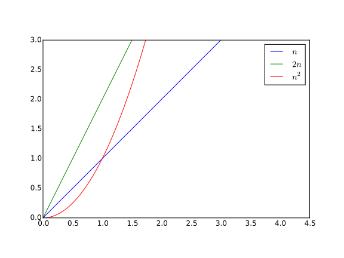
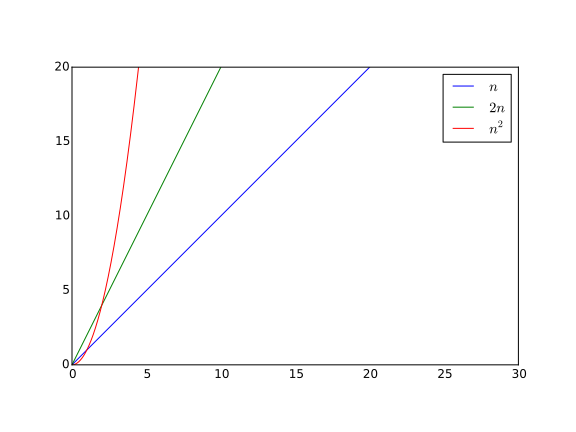
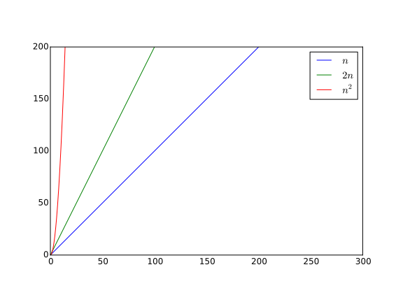
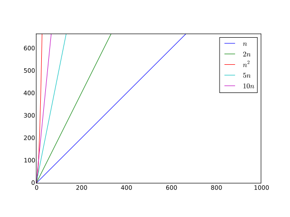
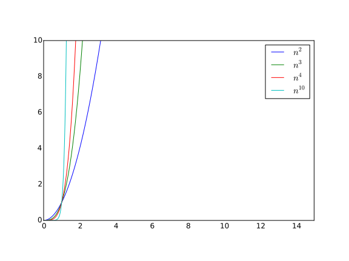
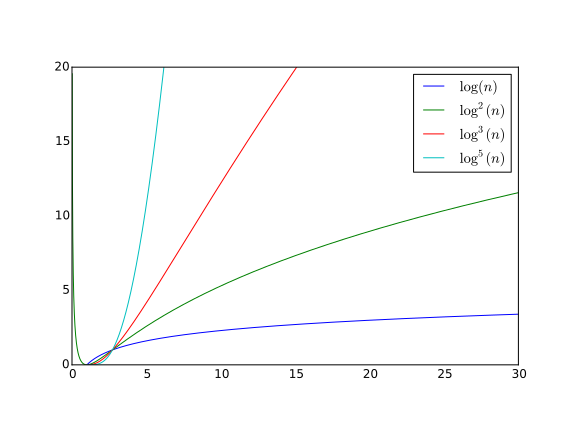
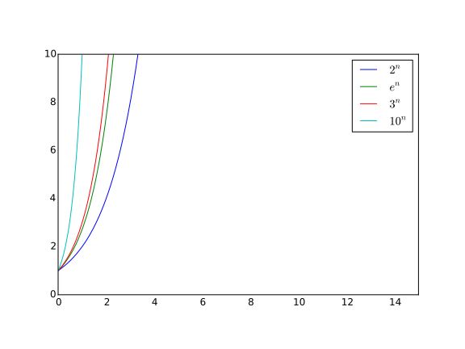

#$$O$$-нотация

Символ $$O$$ (*читается как О большое*) имеет строгое и относительно сложное определение, которое мне бы не хотелось давать тут. Наоборот я хочу показать не сухие формулы и аксиомы, а наглядное представление и понимание, зачем и почему это понятие существует. Итак, перейдем сначала к примерам.  

Допустим $$n$$ - это количество операций$$/$$памяти$$/$$обращений к базе данных$$/$$и т.д. в нашем алгоритме. Возьмем несколько функций: $$n$$, $$2n$$, $$n^2$$, и посмотрим на них в небольшом масштабе.

На этом графике мы видим, что $$2n$$ и $$n^2$$ растут намного быстрее $$n$$ и даже имеют сходство в поведении. Но стоит нам чуть-чуть отдалиться...

Теперь ясно видно - $$n^2$$ лидирует в скорости роста, $$2n$$ за ним, и в конце $$n$$. Сейчас еще сложно понять, чем принципиально отличается отношение $$n^2$$ к $$2n$$ и $$2n$$ к $$n$$. И уменьшая масштаб еще немного...

Вы видите, что $$n^2$$ уже почти не отличается от вертикальной линии, возрастая очень быстро. Таким образом (вы можете это проверить сами в любой программе построения графиков) $$n^2$$ всегда обгонит любую линейную функцию $$kn$$ и при достаточном масштабе картинка будет аналогична предыдущей $$-$$ $$n^2$$ будет казаться вертикальной линией, а линейная функция будет выглядеть одинаково на любом графике. 

И как раз вот это различие в поведении квадратичных и линейных функций играет большую роль в оценке сложности алгоритмов. Любой алгоритм, который делает $$n^2$$ операций вместо $$kn$$ (даже если $$k$$ достаточно большое, например около $$10^3$$) всегда будет проигрывать линейному. В примере с $$k=10^3$$ это разница уже будет заметна при $$n = 10^4$$ ($$n^2=10^{8}$$, $$kn = 10^7$$). 

Поэтому и вводят обозначение $$O$$. $$O(f)$$ обозначает все функции, которые имеют такой же или меньший порядок роста как и $$f$$, например $$O(n^2)$$ будет содержать $$n^2$$, $$3n^2$$, $$4n^2 + 5$$ и даже $$n^2 + n$$, так как умножение на константу и прибавление медленных по сравнению с данной функций не меняют картину *(вспоминаем последний график, прибавление чего-то маленького к большому не меняет порядок большого, а умножение на константу не может  увеличить рост на порядок)*. Таким же образом $$O(n)$$ содержит все функции вида $$kn + c$$. Еще интересно заметить, что $$O$$ от быстрых функций содержит более медленные, то есть $$O(n^2)$$ содержит $$n$$, но $$n^2$$ уже не будет лежать в $$O(n)$$. 

Теперь рассмотрим еще несколько важных функций. Мы уже видели поведение $$n^2$$ и $$n$$ на графиках, и по аналогии можно заметить, что функция $$n^k$$ при $$k > 0$$ тоже растет быстрее чем все остальные с меньшим $$k$$. То есть существуют классы функций $$O(n), O(n^2), O(n^3) \dots O(n^k) \dots$$, каждый из которых содержит все предыдущие, но в тоже время у каждого есть и уникальные функции (например, для класса $$O(n^k)$$ это многочлены вида $$c_kn^k + c_{k-1}n^{k-1} + \dots + c_1n + c_0$$, где $$c_k, c_{k - 1}, c_{k - 2} \dots $$ - произвольные константы, и $$c_k \neq 0$$ для того, чтобы многочлен оставался степени $$k$$). Например функция $$3n^3 + 4n^2 + 25n + 42$$ принадлежит классу $$O(n^3)$$, функция $$0.0001n^{10} + 1000n$$ клаccу $$O(n^{10})$$ и т.д. Уже видно, что алгоритм определения этого класса очень прост - мы просто берём главное слагаемое многочлена и отбрасываем константу. В принципе, для других разновидностей функций это правило работает похоже, скоро мы это и увидим. 

Следующая важная для нас функция - это логарифм. Можете проверить сами (*в [википедии](https://ru.wikipedia.org/wiki/%D0%9B%D0%BE%D0%B3%D0%B0%D1%80%D0%B8%D1%84%D0%BC#.D0.9F.D1.80.D0.B5.D0.B4.D0.B5.D0.BB.D1.8C.D0.BD.D1.8B.D0.B5_.D1.81.D0.BE.D0.BE.D1.82.D0.BD.D0.BE.D1.88.D0.B5.D0.BD.D0.B8.D1.8F) даны просто формулы, а доказательства можно найти в любом классическом учебнике мат.анализа*), что любая степень логарифма растет медленнее любого многочлена от n, тем самым мы выделяем еще множество новых классов функций $$-$$ $$O(\log(n)), O(\log^2(n)), O(\log^3(n)) \dots O(\log^k(n)) \dots$$ *(Я пишу $$\log$$ без обозначения степени, потому что любые два логарфима с разными степенями [можно привести](https://ru.wikipedia.org/wiki/%D0%9B%D0%BE%D0%B3%D0%B0%D1%80%D0%B8%D1%84%D0%BC#.D0.97.D0.B0.D0.BC.D0.B5.D0.BD.D0.B0_.D0.BE.D1.81.D0.BD.D0.BE.D0.B2.D0.B0.D0.BD.D0.B8.D1.8F_.D0.BB.D0.BE.D0.B3.D0.B0.D1.80.D0.B8.D1.84.D0.BC.D0.B0) к друг другу обычным домножением на константу, и как вы уже знаете, умножение на константу не меняет порядок роста. Так что запись $$O(\log(n))$$ обозначает логарифмы всех возможных степеней.)*

Если понимание уточнений в скобках вызвали у вас трудности, то не обращайте особого внимания, в дальнейшем нам понадобится только то, что $$\log(n)$$ растет намного медленнее любой степени $$n$$ или $$n^k$$.

И последний класс, который будет необходим для дальнейшего изучения алгоритмов - это экспонента. Тут все аналогично многочленам - тоже есть бесконечное множество классов вида $$O(2^n), O(3^n) \dots O(k^n) \dots$$, которые ведут себя точно так же, как и в предыдущих случаях. Опять же легко понять, что экспоненциальные функции всегда обгоняют многочлены и логарифмы, так что будьте осторожными с ними - если ваш алгоритм делает, например, $$2^n$$ операций (*а при $$n = 20$$ это уже около $$10^6$$*), то стоит хорошенько подумать, нужен ли такой алгоритм вообще. 

Под конец хочется отметить важный паттерн, который встречается даже не часто, а почти в каждом сравнении работы алгоритмов. Это - $$O(n \log(n))$$, он является неким промежуточным звеном между почти идеальным временем работы $$O(n)$$ и нередко легко получаемым $$O(n^2)$$. Само домножение на логарифм заметно уменьшает количество операций по сравнению с $$n^2$$, но в то же время требует сопоставимых умственных усилий и нетривиальной работы. Во многих дальнеших главах мы будем сначала рассматривать несложные реализации работающие за какую-нибудь степень, например $$O(n^3)$$, и затем модифицировать алгоритм так, что одно $$n$$ "пропадает", заменяясь на $$\log(n)$$, в нашем случае получается $$O(n^2\log(n))$$.

Теперь приведем значения некоторых из этих функций в точках $$n = 10$$, $$100$$, $$1000$$, $$10^6$$. *(Значения в таблице отражают скорее порядок и размер чисел, чем точные данные)*

| $$n$$ | $$10$$ | $$100$$ | $$1000$$ | $$10^6$$|
| -- | -- | -- | -- |
| $$n\log_2(n)$$| $$30$$ | $$600$$ | $$10000$$ | $$2 * 10^7$$ |
| $$n^2$$ | $$100$$ | $$10000$$ | $$10^6$$ | $$10^{12}$$ |
| $$n^3$$ | $$1000$$ | $$10^6$$ | $$10^9$$ | $$10^{18}$$ |
| $$\log_2(n)$$ | $$3$$ |$$6$$ | $$10$$ | $$20$$ |
| $$2^n$$ | $$1000$$ | $$10^{30}$$ | $$10^{301}$$ | $$10^{300000}$$ |

###Что дальше?
Этих знаний вам хватит, чтобы полностью понять выкладки дальнейших глав и даже самим вычислять асимптотику многих алгоритмов. Можно начинать читать любую следующую главу, почти в каждой из них присутствует символ $$O$$ и небольшие вычисления. 