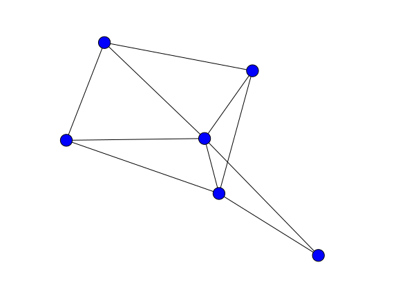

#Графы
В этой главе мы поговорим о том, что такое граф и как хранить его в компьютере. Само по себе понятие граф лучше всего представлять графически: это набор вершин (обозначаемые как $$V$$) и набор ребер между этими вершинами (обозначаем как $$E$$).  

Некоторые вершины (между которыми есть ребро) соединены, некоторые нет. Можно представить, для примера, карту дорог, где города - это вершины, а дороги между ними - это ребра. 

В компьютере весь этот граф может храниться разными способами. Первый и самый очевидный способ - это хранить два множества: множества вершин (обычно вершины нумеруют числами от 1 до $$N$$ и не хранят это множество явно) и множество пар, которые будут обозначать двойки вершин, между которыми есть ребра. Но этот способ плохо работает, когда нам нужно обходить или искать что-нибудь в графе. Поэтому чаще всего используют один из двух способов хранения графа в памяти: матрица смежности или списки связности. 

Матрица смежности - это матрица размера $$|V|$$ x $$|V|$$, где в ячейке ($$i$$, $$j$$) стоит 1, если между вершинами $$i$$ и $$j$$ есть ребро, а иначе 0. 

Приведем реализацию основных операций для работы с ней, и потом уже поговорим про асимптотику и особенности данной структуры. 

```
# строим матрицу по множеству ребер
def build_matrix(edges, N): # edges - это пары вершины, между которыми есть ребро
    matrix = [[0] * N] * N  # матрица из нулей размером N x N
    for edge in edges:      # обходим все ребра и помечаем нужные ячейки в матрице
        matrix[edge[0]][edge[1]] = 1
    return matrix
```
```
# поиск всех соседей данной вершины
def find_neighbours(matrix, N, v): 
    return [i for i in range(N) if matrix[v][i] == 1] 
    # все вершины, у которых стоит единичка, 
    # обозначающая ребро между ней и v
```    

Как видите, построение этой матрицы очень просто, и поиск соседних вершин выполняется так же без особых усилий - мы смотрим либо изменяем нужную ячейку и все. Но за простоту надо платить, и платим мы за нее скоростью работы. Сама матрица имеет размер $$|V|^2$$ и это уже $$O(|V|^2)$$ операций на построение. Потом поиск всех вершин, у которых есть ребро с данной, занимает тоже много времени, а именно $$O(|V|)$$. Естественно, при очень большом колиечестве ребер, то есть примерно равном $$|V|^2 / 2$$, это асимптотика кажется очень неплохой, но, к сожалению, в реальной жизни таких графов почти не бывает (вспомним ту же карту дорог - если бы между каждым городом было по дороге, то производители асфальта давно бы уже стали богаче нефтянников). Таким образом, оставим матрицу смежности для графов с большим количеством ребер и перейдем с спискам связности. 

Списки связности в отличие от матрицы смежности зависят от количества ребер в хранимом графе. Для каждой веришны создается список, в котором содержатся все вершины, для которых есть ребро с нужной. По сути, в этом списке хранятся все ребра выходяющие из какой-то одной вершины. Суммируя все списки по всем вершинам, получаем все ребра в графе, тем самым вся структура занимает $$O(|E|)$$ памяти и требует $$O(|E|)$$ операций для построения. Поиск соседних вершин в худшем случае тоже может занимать $$O(|V|)$$ (потому что у вершины может быть как раз ровно $$|V| - 1$$ сосед), но фокус в том, что если эту операцию поиска провести для всех вершин в графе, то мы не сможем получить более $$O(|E|)$$ операций (можно рассуждать так же как и с асимптотикой построения списков - поиск занимает $$O(|E_v|)$$ операций, где $$E_v$$ - ребра выходящие из вершины $$v$$. И мы складываем все $$Е_v$$ для каждой вершины, и хотя какое-нибудь $$|E_v|$$ может быть равно примено $$|V|$$
