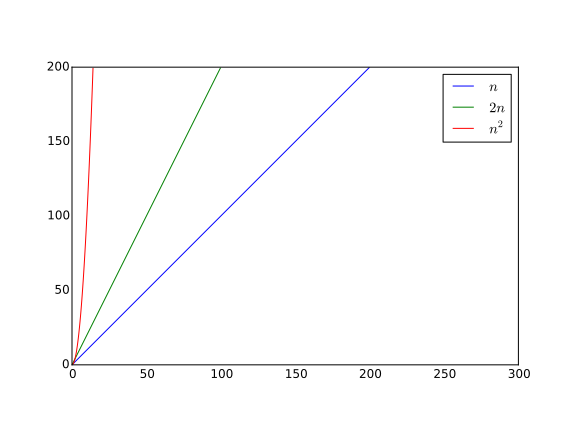

#$$О$$-нотация

Что же такое вообще это $$О$$? Полное и обширное определение данного понятия вы сможете прочитать в учебнике мат.анализа, и я не буду повторять эти великие произведения и дам наглядное определение. 

Рассмотрим такую запись как $$O(n)$$, где $$n$$ - это количество операций$$/$$памяти$$/$$обращений к базе данных$$/$$и т.д. в нашем алгоритме. Теперь рассмотрим несколько функций: $$n$$, $$2n$$, $$n^2$$.

Зеленый график - это $$n$$, синий - $$2n$$, красный - $$n^2$$. 

В этом масштабе мы видим, что $$2n$$ и $$n^2$$ растут намного быстрее $$n$$ и даже имеют сходство в поведении. Но стоит нам чуть-чуть отдалиться...

Теперь ясно видно - $$n^2$$ лидирует в скорости роста, $$2n$$ за ним, и в конце $$n$$. Сейчас еще сложно понять, чем принципиально отличается отношение $$n^2$$ к $$2n$$ и $$2n$$ к $$n$$. И уменьшая масштаб еще немного...

Вы видите, что $$n^2$$ уже почти не отличается от вертикальной линии, возрастая очень быстро. Таким образом (вы можете это проверить сами в любой программе построения графиков) $$n^2$$ всегда обгонит любую линейную функцию $$kn$$ и при достаточном масштабе картинка будет аналогична предыдущей $$-$$ $$n^2$$ кажется вертикальной линией, а линейная функция не меняет своего поведения. 

И как раз вот это различие в поведении квадратичных функций и линейных играет большую роль в оценке сложности алгоритмов. Любой алгоритм, который делает $$n^2$$ операций вместо $$kn$$ (даже если $$k$$ достаточно большое, например около $$10^3$$) всегда будет проигрывать линейному. В примере с $$k=10^3$$ это разница уже будет заметна при $$n = 10^4$$ ($$n^2=10^{8}$$, $$kn = 10^7$$). 

Поэтому и вводят обозначение $$O$$. $$O(f)$$ обозначает все функции, которые имеют такой же или меньший порядок роста как и $$f$$, например $$O(n^2)$$ будет содержать $$n^2$$, $$3n^2$$, $$4n^2 + 5$$ и даже $$n^2 + n$$, так как умножение на константу и прибавление медленных по сравнению с данной функций не меняют картину *(вспоминаем последний график, прибавление чего-то маленького к большому не меняет порядок большого, а умножение на константу не может  увеличить рост на порядок)*. Таким же образом $$O(n)$$ содержит все функции вида $$kn + c$$. Еще интересно заметить, что $$O$$ от быстрых функций содержит более медленные, то есть $$O(n^2)$$ содержит $$n$$, но $$n^2$$ уже не будет лежать в $$O(n)$$. 

Теперь рассмотрим несколько важных классов функций. Мы уже видели поведение $$n^2$$ и $$n$$ на графиках, и по аналогии можно заметить, что функция $$n^k$$ при $$k > 0$$ тоже растет быстрее чем все остальные с меньшим $$k$$. То есть существуют классы функций $$O(n), O(n^2), O(n^3) \dots O(n^k) \dots$$, каждый из которых содержит все предыдущие, но в тоже время у него есть и уникальные функции (для класса $$O(n^k)$$ это многочлены вида $$c_kn^k + c_{k-1}n^{k-1} + \dots + c_1n + c_0$$). 

Следующая важная для нас разновидность функций - это логарифмы. Можете проверить сами, что любая степень логарифма растет медленнее любой степенной функции, тем самым мы обнаружили еще кучу новых классов функций $$-$$ $$O(log(n)), O(log^2(n)), O(log^3(n)) \dots O(log^k(n)) \dots$$ *(Я пишу $$log$$ без обозначения степени, потому что любые два логарфима с разными степенями можно привести к друг другу обычным домножением на константу, а как вы уже знаете, домножение на константу не меняет порядок роста. Так что запись $$O(log(n))$$ обозначает логарифмы всех возможных степеней.)*

И последний класс, который будет необходим для дальнейшего изучения алгоритмов - это экспонента. Тут все аналогично степенным функциям - тоже есть бесконечное множество классов вида $$O(2^n), O(3^n) \dots O(k^n) \dots$$, которые ведут себя точно так же, как и в предыдущих случаях. Понятно, что экспоненциальные функции всегда обгоняют степенные и логарифмы, так что будьте осторожными с ними - если ваш алгоритм делает, например, $$2^n$$ операций, то стоит хорошенько подумать, нужен ли такой алгоритм вообще. 

В конце хотелось мне бы хотелось просто показать значения некоторых из этих функций в точках $$n = 10$$, $$100$$, $$1000$$, $$10^6$$. *(Числа даны не совсем точные, это сделано для более легкого понимания размера числа и запоминания)*

| $$n$$ | $$10$$ | $$100$$ | $$1000$$ | $$10^6$$|
| -- | -- | -- | -- |
| $$n^2$$ | $$100$$ | $$10000$$ | $$10^6$$ | $$10^{12}$$ |
| $$n^3$$ | $$1000$$ | $$10^6$$ | $$10^9$$ | $$10^{18}$$ |
| $$log_2(n)$$ | $$3$$ |$$6$$ | $$10$$ | $$20$$ |
| $$2^n$$ | $$1000$$ | $$10^{30}$$ | $$10^{301}$$ | $$10^{300000}$$ |

Вот, в общем то, и все. Общую картину я рассказал, а более тонкие детали вы cможете найти либо в интернете, либо в математических книжках. Удачи!